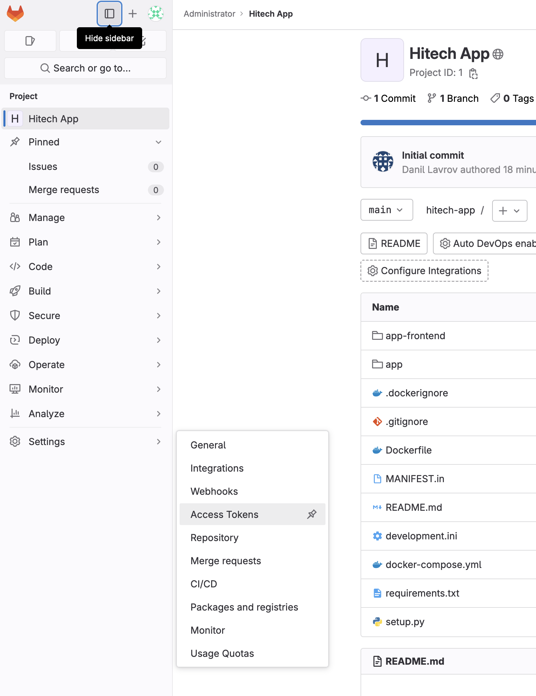
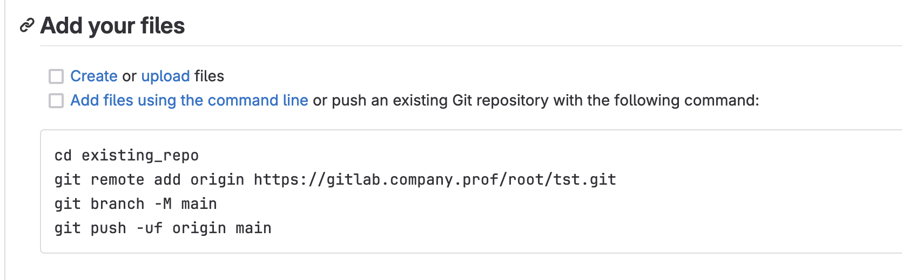

# Configure CA and gitlab

```text
1) На машине cicd разверните gitlab
2) Защитите подключение к gitlab при помощи https
3) Сконфигурируйте gitlab registry для хранения образова docker контейнеров
4) Gitlab должен быть доступен по адресу https://gitlab.company.prof
5) Используйте директорию /opt/gitlab для хранения файлов gitlab
```

## Первым делом нам нужно позаботиться о сертификатах, поэтому следует произвести настройку центра сертификации и сгенерировать сертификаты для gitlab

Идем править конфиг по пути **/etc/ssl/openssl.cnf**

```text
Нас интересуют строки:
dir
copy_extensions
policy 
```

Приведите данные строчки к такому виду:

dir


copy_extensions


policy


Идем править конфиг по пути **/usr/lib/ssl/misc/CA.pl**

Приведите строку CATOP к данному виду:


Теперь можно произвести настройку центра сертификации

```bash
cd /usr/lib/ssl/misc
```

```bash
CA.pl -newca
```

Скипаем все, кроме Common Name и PEM phase phrase


Теперь сгенерируем сами сертификаты

```bash
cd /usr/lib/ssl/misc
```

Генерим сертификат

```bash
openssl req -new -sha256 -nodes -out newreq.pem -newkey rsa:2048 -keyout newkey.pem -config <(
cat <<-EOF
[req]
default_bits = 2048
prompt = no
default_md = sha256
req_extensions = req_ext
distinguished_name = dn

[ dn ]
C=US
ST=New York
L=Rochester
O=End Point
OU=Testing Domain
CN = gitlab.company.prof

[ req_ext ]
subjectAltName = @alt_names

[ alt_names ]
DNS.1 = gitlab.company.prof
DNS.2 = 10.10.10.100 //тут адрес хоста, где расположен гитлаб
EOF
)
```

Полученные сертификаты подписываем

```bash
./CA.pl -sign
```

### Теперь можно перейти к установке gitlab

Экспортим переменную отвечающую за расположение файлов конфигурации гитлаб

```bash
export GITLAB_HOME=/opt/gitlab
```

Создаем директорию для сертификатов

```bash
mkdir /etc/gitlabcer
```

В данную директорию требуется скопировать сгенеренные нами раннее сертификаты newcert.pem и newkey.pem

Ставим docker

```bash
apt install docker docker.io docker-compose -y
```

Теперь создаем и заполняем файл docker-compose.yml таким образом:

```Также обратите внимание, что гитлаб использует 22 порт, поэтому нужно переместить ssh на альтернативный порт или убрать проброс портов из конфигурации```

```yaml
version: '3.6'
services:
  web:
    image: 'gitlab/gitlab-ee:latest'
    restart: always
    hostname: 'gitlab.company.prof'
    environment:
      GITLAB_OMNIBUS_CONFIG: |
        external_url   'https://gitlab.company.prof'
        letsencrypt['enable'] = false
        registry_external_url  'https://gitlab.company.prof:5050'
        registry_nginx['ssl_certificate'] = "/etc/gitlabcer/newcert.pem"
        registry_nginx['ssl_certificate_key'] = "/etc/gitlabcer/newkey.pem"
        nginx['ssl_certificate'] = "/etc/gitlabcer/newcert.pem"
        nginx['ssl_certificate_key'] = "/etc/gitlabcer/newkey.pem"
        # Add any other gitlab.rb configuration here, each on its own line
    ports:
      - '80:80'
      - '443:443'
      - '5050:5050'
      - '22:22'
    volumes:
      - '/etc/gitlabcer:/etc/gitlabcer'
      - '$GITLAB_HOME/config:/etc/gitlab'
      - '$GITLAB_HOME/logs:/var/log/gitlab'
      - '$GITLAB_HOME/data:/var/opt/gitlab'
    shm_size: '256m'

```

Поднимаем гитлаб

```bash
docker-compose up -d
```

Гитлаб довольно долго стартует, поэтому нужно будет подождать. Как только у контейнера будет состояние healthy - можно идти в веб.

Для того, чтобы получить пароль от админа используйте команду

```bash
docker exec -it gitlab grep 'Password:' /etc/gitlab/initial_root_password
```

*gitlab - имя контейнера

Готово, теперь можно переходить по адресу <https://gitlab.company.prof> по кредам root/пароль_полученный_из_контейнера

## Загружаем архив с приложением

Идем и создаем access token



Нажимаем add token


Заполняем как на картинке и  нажимаем create token


Сохраняем куда-нибудь токен


После создания репозитория появляется инструкция по загрузке файлов

Следуем этой инструкции, вместо пароля от юзера используем токен


