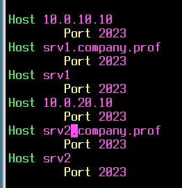

# Базовая настройка

vESR мы тут рассматривать не будем, он в отдельных файлах

## Настройка хостнейма

Работаем от рута или sudo

Делается либо записью файлика **/etc/hostname**, либо командочкой **hostnamectl**

Я рекомендую второй способ

Еще настоятельно рекомендую не забывать прописывать хостнейм в файле **/etc/hosts**

```bash
hostnamectl set-hostname sw1.company.prof
exec bash    #Применяем изменения без перезагрузки
vim /etc/hosts

# Ищем строчку, которая 127.0.1.1. ОБычно там прописан дефолтный хостнейм
# Меняем эту строчку на наш хостнейм, например

127.0.1.1 sw1 sw1.company.prof
```

Должно получится как-то так


И вот так


Надо отметить, что, на разных дистрах может быть по разоному

Например, на альте в файле **hosts** есть только 127.0.0.1

Значит, эту запись и меняем

## Адресация

В основном, у нас есть три пути

1. GUI
2. nmtui
3. Конфиги

Действуем по следующей логике:

Нет nmtui -- идем в конфиги

GUI стараемся максимально не трогать.

Выбрали инструмент, дальше действуем по ситуации

### nmtui

При помощи командочки `nmtui` открываем nmtui

Выглядит типа вот так


Тыкаем п.1


Тыкаем на существующее соеденение и ставим ручную настройку ipv4


Заполняем параметры, идем в самый низ, нажимаем ок


Идем в подключится и перезапускаем наше соеденение


Проверяем, что у нас все получилось, при помощи командочки `ip --br a` (Иногда ключа --br может не быть)


Такой фокус повторяем для всех интерфейсов, если у нас их несколько

### Astra (и deb-based) Конфиги

Открываем файлик **/etc/network/interfaces** и заполняем как на картинке

`auto` -- добавить интерфейс в автозапуск

`iface ... inet ...` -- настройка интерфейса

Выяснить, какие интерфейсы у нас есть можно через `ip a`


После того, как заполнили конфигу для всех интерфейсов перезапускаем демон сети

`systemctl restart networking`

Проверяем также через `ip a`

### alt linux (rpm-based но не все)

В альте нет нетворкменеджера по умолчанию, покрайней мере на сервере

Придется работать через конфиги

В основном, в альте используется **etcnet**

Настраивается записью параметров в файлики

Прежде чем менять какие-то настройки -- надо отредактировать файл **/etc/net/ifaces/< ifname >/options**


Далее можно настроить сеть


## Создание пользователя

Делается впринципе везде одинаково

Для создания пользователя используем `useradd -m`

Так мы создадим юзера с домашней директорией

Для создания пароля используем `passwd < username >`


Для проверки используем su - username

Зашли? Тогда все норм


Вывод может выглядеть по разному, но суть одна


## Настройка sudo

Для начала, надо проверить, есть ли у нас **sudo**

Для этого можно прописать командочку `sudo`


Открылась справка -- норм

Если sudo нет -- надо его установить

В астре и deb-based делаем

```bash
apt update
apt install sudo
```

В alt linux делаем

```bash
apt-get update
apt-get install sudo
```

Дальше нужно сделать так, чтоб юзер мог выполнять команды из под sudo без пароля

Делается легко

```bash
echo "sshuser ALL=(ALL) NOPASSWD: ALL" >> /etc/sudoers
```

На альте еще хорошо бы добавить юзера wheel

```bash
usermod -aG wheel sshuser
```

Теперь можно зайти под sshuser и попробовать что-нибудь повыполнять от sudo

Пароль спросить не должно


## Настройка ssh сервера

### Астра

Если вдруг ssh сервера нет -- можно его установить

```bash
apt update
apt install openssh-server
```

Потом открываем кофиг **/etc/ssh/sshd_config** и редактируем

```text
#Port 22 -- раскометрировали, поменяли на 2023
Port 2023

#PasswordAuthentication yes -- раскомментили, заменили на no
PasswordAuthentication no
```

Сохранились, вышли, перезапустили ssh сервер

```bash
systemctl restart sshd
```

Пробуем постучаться на себя

Сбросит по стандартному порту, пошлет далеко и надолго без ключей


### Альт

Если ssh сервера нет, его можно установить

```bash
apt-get update
apt-get install openssh-server
```

В альте конфига находится по пути **/etc/openssh/sshd_config**

В остальном, все дейсвтия полностью аналогичны тому, что на астре

## Настройка ssh клиента

Пилить конфигу для ssh клиента будем на уровне системы, чтобы уж точно не докапались

### На астре

Идем в **/etc/ssh/ssh_config**

Снизу прописываем что-то типа

```bash
Host <адрес srv1 или srv2>
    Port 2023
```

Например



Прописывать надо сервера и по адресам, и по всем возможным именам

Далее нужно сгенерировать ключи и пробросить их под пользователя sshuser

```bash
ssh-keygen
```

После того, как ключи сгенерированы -- нужно пробросить их под юзера sshuser

Чтобы не страдать -- временно разрешаем парольную аутентификацию, пробрасываем ключи и запрещаем ее обратно

```bash
ssh-copy-id sshuser@10.0.10.10
```
