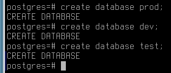
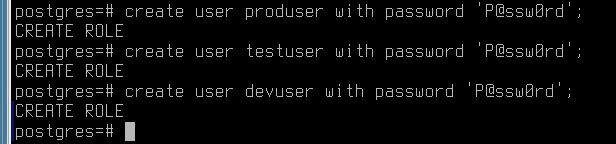
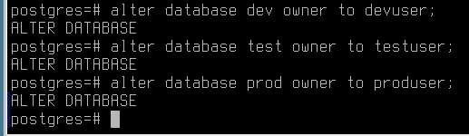
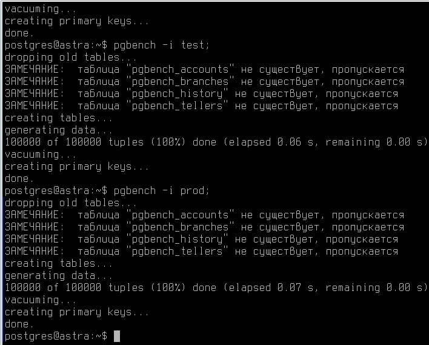

# Установка и настройка сервера баз данных

## Установка

### Астра

```bash
apt install postgresql #Установится postgres11
```

На этом установка завершена, СУБД приезжает уже настроенной и готовой к работе.

### Альт

```bash
apt-get install postgresql11 postgresql11-server postgresql11-contrib
/etc/init.d/postgresql initdb
vim /var/lib/pgsql/data/postgresql.conf
# Ищем строчку, которая начинается на listen, раскомментируем и прописываем *
listen_addresses = '*'
vim /var/lib/pgsql/data/pg_hba.conf
Ищем строчку host со 127.0.0.1 и меняем на 0.0.0.0/0
host all all 0.0.0.0/0 trust
systemctl restart postgresql
```

## Работа с базами

На астре все действия происходят через

```bash
su - postgres
psql
```

На альте через

```bash
psql -U postgres
```

### Создаем базы

```sql
create database prod;
create database test;
create database dev;
```



### Создаем юзеров

```sql
create user produser with password 'P@ssw0rd';
create user devuser with password 'P@ssw0rd';
create user testuser with password 'P@ssw0rd';
```



### Даем юзерам права на базы

```sql
alter database dev owner to devuser;
alter database prod owner to produser;
alter database test owner to testuser;
```



### создаем суперюзера

```sql
create user dbadmin superuser;
alter user dbadmin with password 'P@ssw0rd';
```

## Заполняем базы

Делается не из шелла postgresql, а из баша

### На астре

```bash
su - postgres
pgbench -i dev
pgbench -i test
pgbench -i prod
```



На альте это делать не надо, туда будет идти репликация

## Настройка репликации

В настоящий момент известно, что репликация не работает

Идем в `/etc/postgresql/../main/pg_hba.conf`

```text
# Так же добавляем в раздел с репликацией
# replication privilege
host    replication    all     <ip адрес второго сервера>    trust
```

Далее идём в конфигурациюю /etc/postgresql/../main/postgresql.conf и добавляем следующее

```text
wal_level = replica
max_wal_senders = 8
wal_keep_size = 32
```

Перезапускаем postgresql

```bash
systemctl restart postgresql
```

Идём на SRV-BR

редактируем файл /etc/postgresql/../main/pg_hba.conf

Добавляем следующие строки, тем самым мы разрешаем подключаться всем внешним пользователям к нашей базе данных

```text
host    replication    all     <ip адрес первого сервера>    trust
```

Редактируем файл /etc/postgresql/../main/postgresql.conf

приводим строку listen_address к такому виду

```text
listen_addresses = 'localhost, <ip адрес текущего сервера>'
```

Останавливаем службу postgresql

```bash
systemctl stop postgresql
```

Переходим в каталог и удаляем содержимое каталога main

```bash
cd /var/lib/postgresql/<version>
rm -rf /main/*
```

Делаем бэкап баз с мастер-сервера

```bash
pg_basebackup -h <ip srv1> -U postgres -D ./ -R -P
```

Запускаем postgresql

```bash
systemctl start postgresql
```

Заходим в psql и смотрим, что есть всё, что было на первом сервере

```bash
sudo -u postgres psql
postgres=# \l
```

## Установка haproxy

Устанавливаем haproxy на SRV1

```bash
apt install -y haproxy
```

Добавляем в `/etc/haproxy/haproxy.cfg`

```text
frontend pg_frontend
        bind *:5431
        mode tcp
        default_backend pg_backend

backend pg_backend
        mode tcp
        balance first
        server srv1 <ip srv1>:5432 check
        server srv2 <ip srv2>:5432 check backup
        option redispatch
```

Перезапускаем haproxy

```bash
systemctl restart haproxy
```

## CloudBeaver

На любом сервере устанавливаем docker-compose и запускаем cloudbeaver

```yaml
version: '3'
services:
  cloudbeaver:
    image: dbeaver/cloudbeaver
    container_name: cloudbeaver
    ports:
      - "8978:8978"
    restart: unless-stopped
    volumes:
      - "./logs:/opt/cloudbeaver/logs"
      - "./workspace:/opt/cloudbeaver/workspace"
```

На том же сервере устанавливаем и конфигурируем nginx

```text
server {
  listen 443 ssl;
  server_name db-adm.company.prof;
  ssl_certificate     /root/newcert.pem;
  ssl_certificate_key /root/newkey.pem;
location / {
    proxy_pass       http://localhost:8978;
    proxy_set_header X-Real-IP $remote_addr;
    proxy_set_header X-Forwarded-For $proxy_add_x_forwarded_for;
    proxy_set_header Host $http_host;
    proxy_http_version 1.1;
    proxy_set_header Upgrade $http_upgrade;
    proxy_set_header Connection "upgrade";
 }
}
```
