# Настройка дисковой подсистемы

## Зеркалируемый LVM на SRV1

Находим диски, из которых будем собирать LVM через `lsblk`

Названия дисков будут отличаться. Выглядеть диски должны как неиспользуемые.

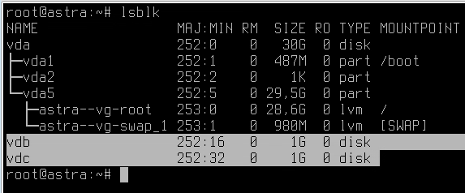

Сначала диски надо подготовить

```bash
fdisk /dev/vdb
n
enter
enter
enter
t
8e
w
```

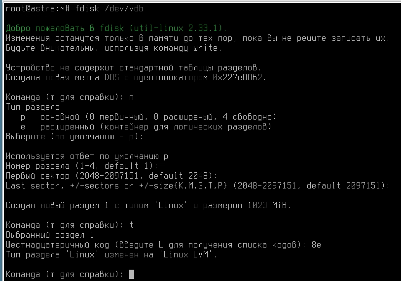

Второй готовим по аналогии

Далее собирем LVM

```bash
pvcreate /dev/vdb1 /dev/vdc1
vgcreate hitech_vg /dev/vdb1 /dev/vdc1
lvcreate -l 100%FREE -m1 -n mirror hitech_vg
```

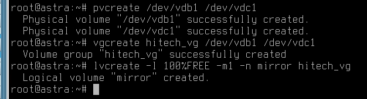

Проверить можно через `lvdisplay -v`

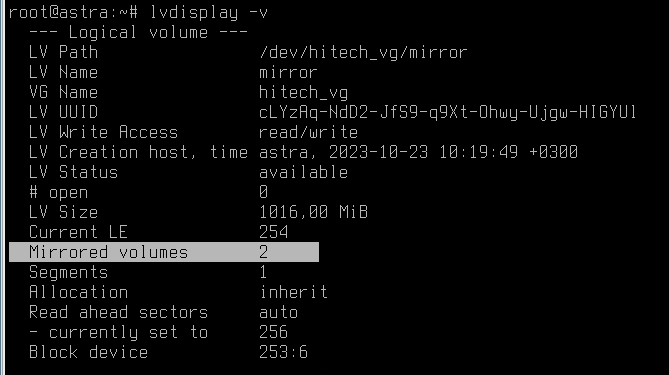

Далее, нужно автоматически монтировать в `/opt/data`

Делаем файловую систему

```bash
mkfs.xfs /dev/hitech_vg/mirror
```

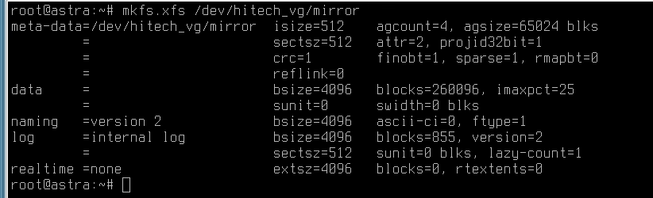

Создаем каталог и добавляем запись в fstab

```bash
mkdir /opt/data
vim /etc/fstab
/dev/hitech_vg/mirror /opt/data xfs defaults 0 0
```

Проверить можно через `mount -av`

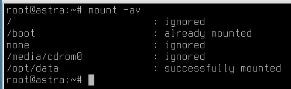

## Шифрованный на SRV2

Производим подготовку и сборку LVM точно также как на SRV1

Надо учесть, что в альте нет `fdisk`

Вместо него юзаем `sfdisk`

```bash
sfdisk /dev/vdb
,
write
```

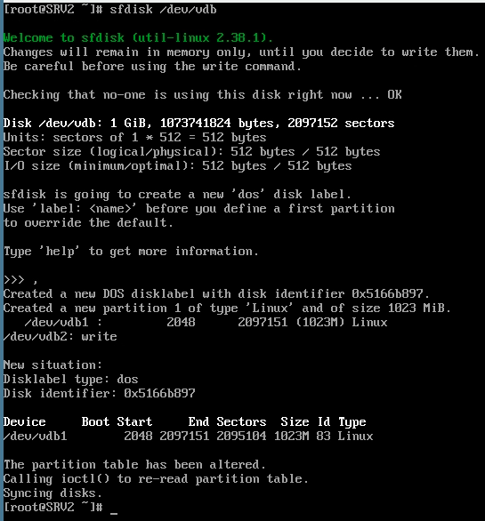

Только в командочке `lvcreate` не пишем ключ `-m1`

```bash
lvcreate -i 2 -I 4 -l +100%FREE -n encrypted hitech_vg
```

Теперь шифруем примерно вот так

```bash
cryptsetup luksFormat --hash=sha512 --key-size=512 --cipher=aes-xts-plain64 --verify-passphrase /dev/hitech_vg/encrypted
```

Пароль ставим не P@ssw0rd, что-нибудь посложнее
Главное не забыть

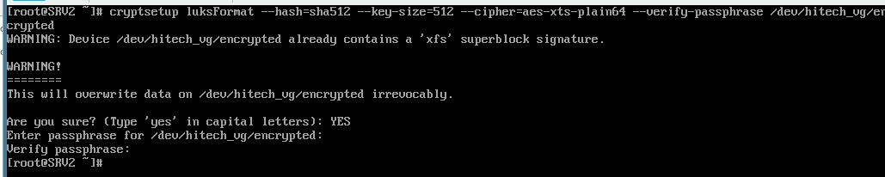

Проверим, что оно зашифровалось через luksOpen

```bash
cryptsetup luksOpen /dev/hitech_vg/encrypted unencrypted
```

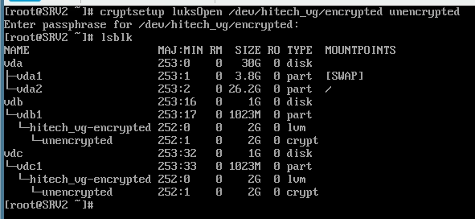

Том, который называется unencrypted уже можно монтировать

Теперь надо сделать так, чтобы он нормально монтировался при загрузке без ввода пароля

Для начала создаем ключик

```bash
dd if=/dev/random bs=32 count=1 of=/root/key
cryptsetup luksAddKey /dev/sdb1 /root/key
```

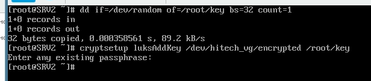

Потом добавляем в `/etc/crypttab` запись вида

```text
unencrypted /dev/hitech_vg/encrypted /root/key
```

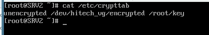

После этого надо ребутнуться и проверить, что диск расшифровывается при загрузке

Смотрим `lsblk` -- если есть расшифрованный раздел, норм

Не забываем добавить файлуху

Добавляем в `fstab` запись с расшифрованным разделом

```text
/dev/mapper/unencrypted /opt/data xfs defaults 0 0
```
