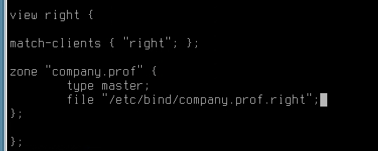

# Настройка DNS

## Основной сервер

Ставим бинд

```bash
apt install bind9
```

Первый файл, который нужно поправить -- `/etc/bind/named.conf.options`

```text
forwarders { 77.88.8.8; };
dnssec-validation no;
listen-on { any; };
```


Потом идем в `/etc/bind/named.conf.default-zones`

В самом низу описываем нашу зону

Прямую и обратную

```text
zone "company.prof" {
    type master;
    file "/etc/bind/company.prof";
};

zone "0.10.in-addr.arpa" {
    type master;
    file "/etc/bind/0.10.in-addr.arpa";
};
```


Идем в `/etc/bind` и создаем зоны из шаблона


Открываем для редактирования прямую зону `company.prof`

Заполняем зону


Аналогично с обратной зоной


Когда все сделано -- проверяемся через `named-checkconf -z`


Если все в порядке -- `systemctl restart bind9`


## split-brain

Для реализации нужно настроить acl и view

Заходим в `/etc/bind/named.conf.local`

Пишем 2 acl

```text
acl "left" {10.0.10.0/24; };
acl "right" {10.0.20.0/24; };
```


Далее в файле `/etc/bind/named.conf.default-zones` создаем views


Очень важно поместить все созды в view left, то есть закрывающая скобка ставится внизу файла, после описания всех зон

Внизу же размещается view right

Во view right размещается зона company.prof, но путь к файлу будет другим



Открываем для редактирования файл с зоной company.prof и добавляем туда запись test


Копируем этот файл в company.prof.right и открываем файл для редактирования

Меняем адрес записи test на адрес srv2


Все готово, теперь с из сети left запись будет резолвиться в адрес srv1, а из сети right в адрес srv2


## Второй DNS сервер

На мастер сервере заходим в файл с зоной и разрешаем ее скачивать


На SRV2 ставим bind

```bash
apt-get install bind
```

Открываем `/etc/bind/options.conf`

```text
listen-on { any; };
```

Далее открываем `/etc/bind/local.conf` и прописываем зоны


После того, как все сделали  перезапускаем bind

```bash
systemctl restart bind
```

В логах можно посмотреть, приехал ли файл


Файл недоступен для редактирования


Резолв работает


