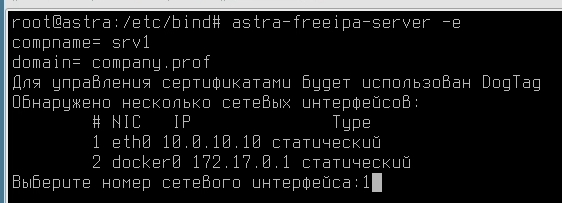
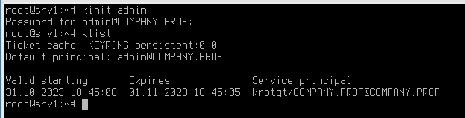
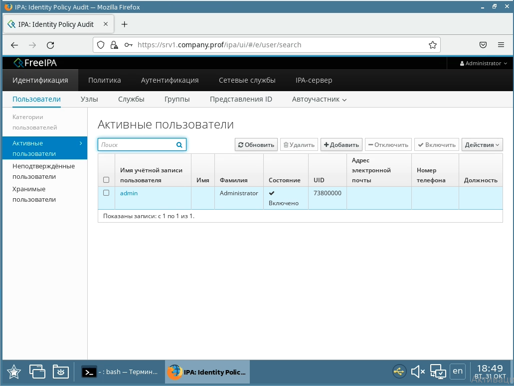
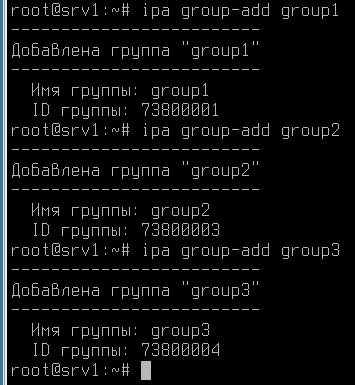
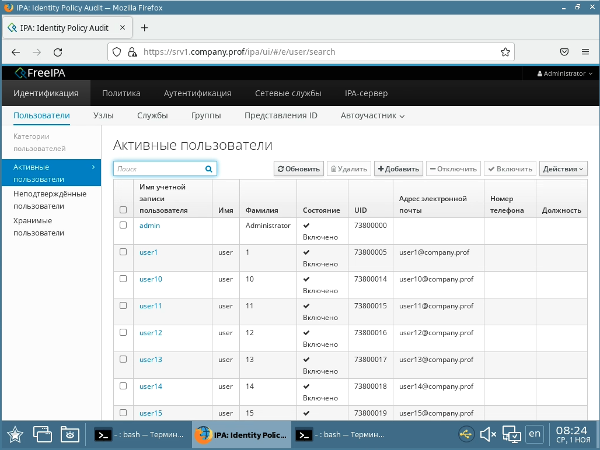
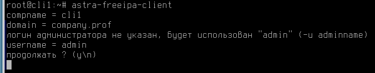
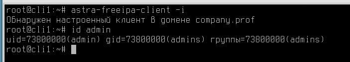
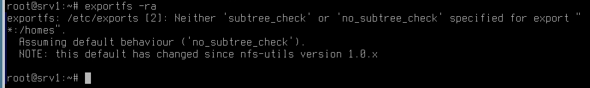

# Настройка доменных служб

## Устанавливаем freeipa

Ставим freeipa

Ставим хостнейм как fqdn. Обязательно маленькими буквами

```bash
hostnamectl set-hostname srv1.company.prof
```

Прописываем адрес сервера в файл `hosts`

```text
10.0.10.10 srv1.company.prof srv1
```

Ставим пакеты

```bash
apt install astra-freeipa-server
```

Выполняем команду `astra-freeipa-server -e`



Вводим пароль, его желательно запомнить

Ожидаем конца развертывания, идти может долго

По завершении появится файлик /tmp/ipa.system.records.< uuid >.db

Надо выкатить его в файл зоны company.prof

```bash
cat /tmp/ipa.system.records.*.db >> /etc/bind/company.prof
```

После этого можно ребутать машину

После ребута можно попробовать запросить керберос билет

```bash
kinit admin
klist
```



Также freeipa доступна в вебе



## Создаем юзеров

Для начала создаем три группы. Можно в вебе, можно через консоль

```bash
kinit admin
ipa group-add group1
ipa group-add group2
ipa group-add group3
```



Пишем скрипт для создания юзеров

```bash
for i in $(seq 30); do
    ipa -n user-add user$i --first user --last $i --password P@ssw0rd
    if [[ $i = [1-9] ]] || [[ $i = "10" ]]; then ipa -n group-add-member group1 --users=user$i; fi
    if [[ $i = 1[1-9] ]] || [[ $i = "20" ]]; then ipa -n group-add-member group2 --users=user$i; fi
    if [[ $i = 2[1-9] ]] || [[ $i = "30" ]]; then ipa -n group-add-member group3 --users=user$i; fi
done
```

Пользователи успешно созданы



## Вводим клиента в домен

Ставим клиентский софт

```bash
apt install astra-freeipa-client
```

Не забываем настроить клиента на использование нашего DNS сервера

```bash
echo 10.0.10.10 > /etc/resolv.conf
```

Вводим машину в домен

```bash
astra-freeipa-client --par --force
```



Проверяем, что все в порядке



## Перемещаемые профили

Ставим nfs сервер

```bash
apt install nfs-kernel-server
```

Создаем директорию, где будем хранить профили

```bash
mkdir /homes
chmod 777 /homes
```

Предоставляем общий доступ к директории

```bash
vim /etc/exports
/homes *(rw,sync,no_root_squash)
```

Перезапускаем nfs сервер для применения конфигурации

```bash
systemctl restart nfs-kernel-server
```

Через `exportfs -ra` можно проверить, что все как надо



Далее монтируем на клиенты эту шару

```bash
vim /etc/fstab
10.0.10.10:/homes /home nfs _netdev,defaults 0 0
```

Проверяем через `mount -av`

Монтируем на второго клиента аналогично

Главное не заходить под одним юзером на две тачки
