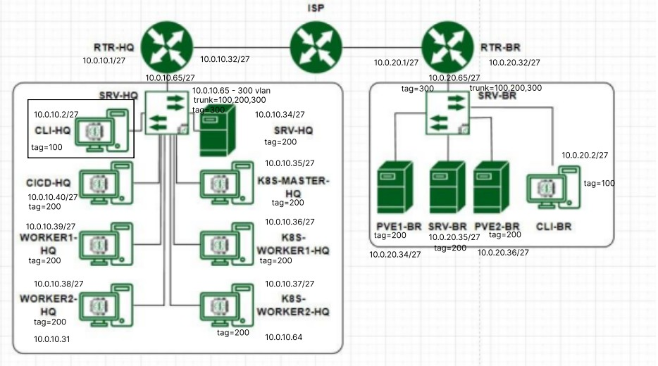

#Текст

```/etc/resolv.conf
   nameserver 77.88.8.8
```

systemctl restart network

```
включить инт
int <int>
no sh

Либо
enable

cdrom - delete!
```



## Порядок действий
```
hostname ip address
openvswitch
routers
bd 2 srv + 
DNS все сервера и клиенты
freeipa

IPSEC
```
## ещё команды
```
ip addr add 10.0.10.32/27 dev eth0
ip route add default via 10.0.10.31
```

```
ip link set up <device>
```

```
apt install NetworkManager
Либо на альте
apt-get install NetworkManager

```

```
vim /etc/eth0.sh

Пишем
ip addr add ...
ip route add ...
```

```
chmod +x /etc/eth0.sh
vim /etc/crontab

Пишем
@reboot root /etc/eth0.sh

```

```
vim 
vi
nano
```
