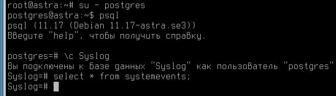
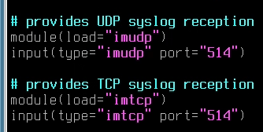
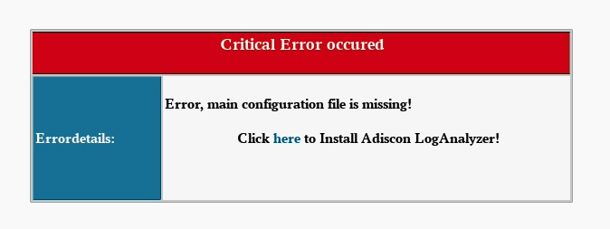
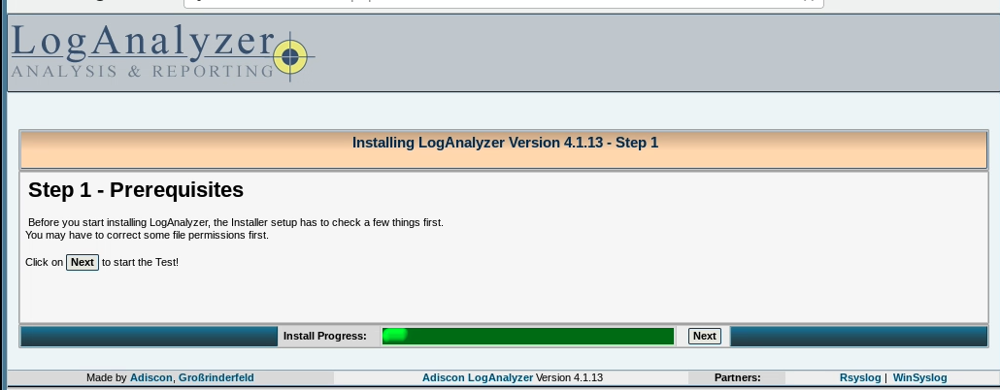
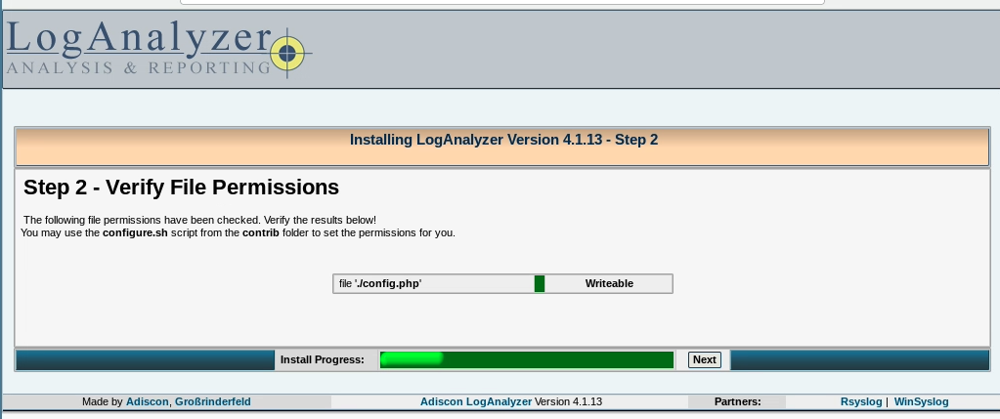
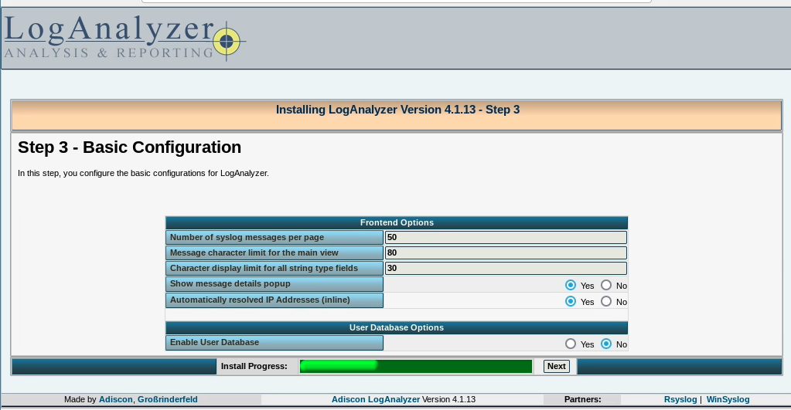
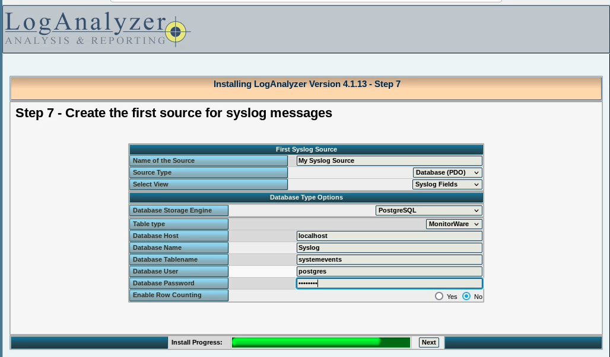
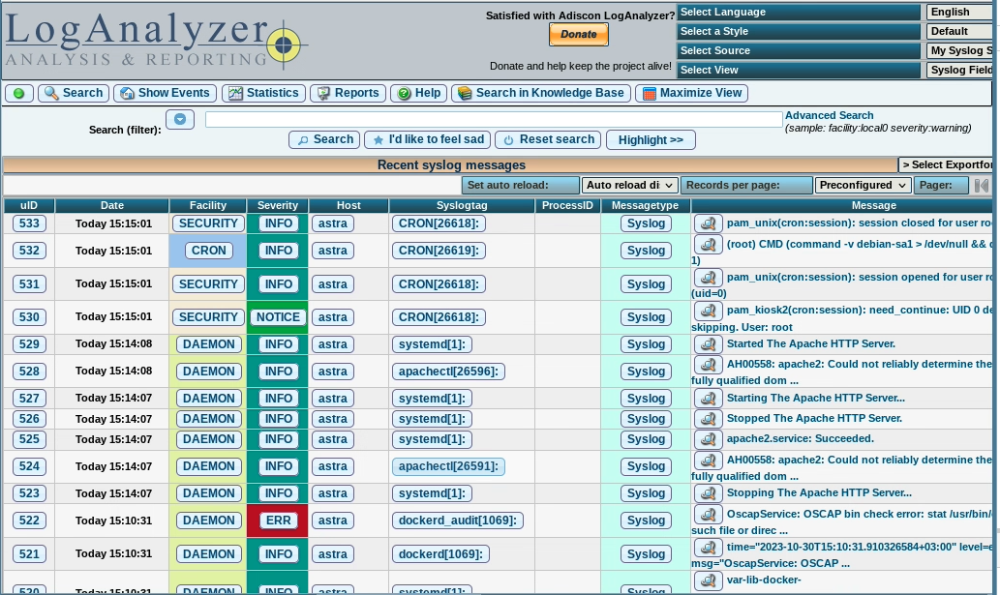

# Настройка системы централизованного журналирования

## Установка и настройка rsyslog

```bash
apt install rsyslog rsyslog-pgsql
```

при установке указываем пароль P@ssw0rd и сервер localhost

База и подключение сконфигурируется автоматически



```bash
vim /etc/rsyslog.conf
Раскомментим imtcp и imudp
```



Перезапускаем rsyslog

```bash
systemctl restart rsyslog
```

Для удаленной отправки логов идем в `rsyslog.conf` на целевой машине и пишем

```text
*.* @10.0.10.10
```

На элтексте смотри [eltex](../vesr/vesr.md#логи)

## Установка loganalyzer

Первым делом пропатчим таблицу, чтоб loganalyzer работал

```bash
su - postgres
psql
\c Syslog
alter table systemevents add column processid int;
```

Получаем архив с loganalyzer

Ставим пакеты

```bash
apt install apache2 php php-pgsql 
```

Распаковываем loganalyzer

```bash
rm -rf /var/www/html/*
tar xvf loganalyzer.tar.gz
mv loganalyzer/src/* /var/www/html/
touch /var/www/html/config.php
chmod 666 config.php
chown www-data:www-data /var/www/html/* -R
```

Чуть правим конфигу апача

```bash
vim /etc/apache2/apache2.conf
Ищем AstraMode и меняем на off
AstraMode off
```

Заходим на сервер с логаналайзером



Нажимаем на here



Нажимаем на next



И еще раз на next



И еще раз на next



Source type -> Database (PDO)

Database Storage Engine -> Postgresql

Database Name -> Syslog

Database User -> postgres

Database Password -> P@ssw0rd


Ура победа, жмем finish


