# Настройка системы централизованного мониторинга

## Настраиваем сервер

Ставим пакеты

```bash
sudo apt install zabbix-server-pgsql zabbix-frontend-php php-pgsql
```

Конфигурируем php

```bash
vim /etc/php/7.3/apache2/php.ini
date.timezone = Europe/Moscow
```

Настраиваем базу данных

```bash
su - postgres
psql
CREATE DATABASE ZABBIX;
CREATE USER zabbix WITH PASSWORD 'P@ssw0rd';
GRANT ALL ON DATABASE zabbix to zabbix;
```

Импортируем схему

```bash
zcat /usr/share/zabbix-server-pgsql/{schema,images,data}.sql.gz | psql -h localhost zabbix zabbix
```

Включаем конфигу

```bash
a2enconf zabbix-frontend-php
systemctl restart apache2
```

Заходим в браузере по `hhtp://10.0.10.10/zabbix` и настраиваем zabbix

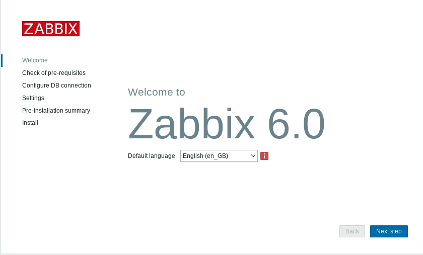

Жмем Next step

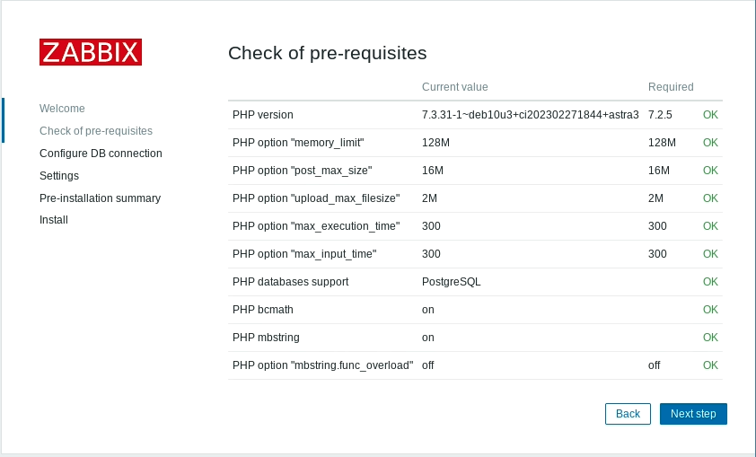

И еще раз Next step


Заполняем как на картинке, снимаем галочку Database TLS encryption

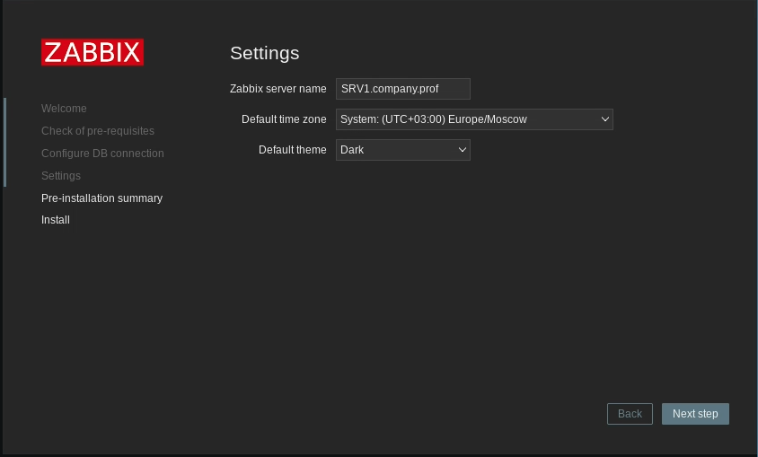

Жмем Next step

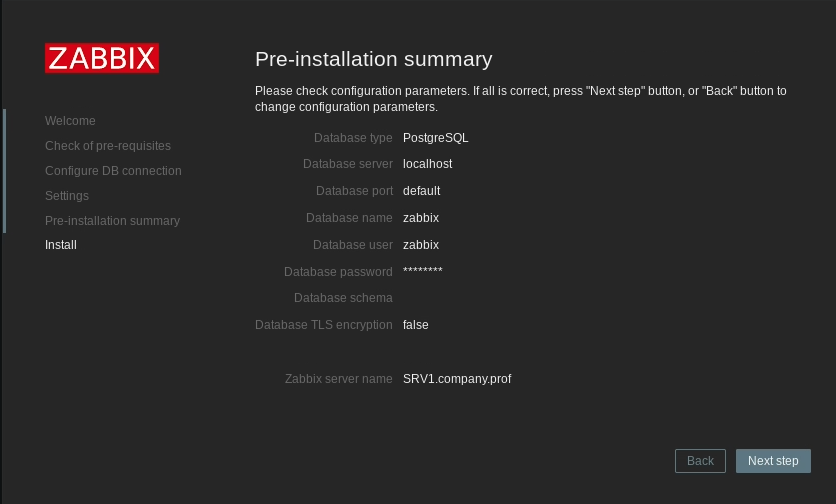

И еще раз Next step

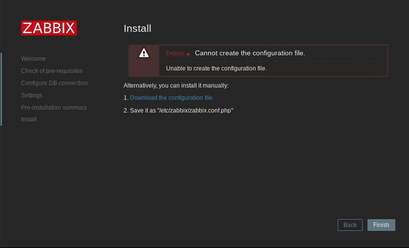

Скачиваем конфигу и закидываем в `/etc/zabbix/zabbix.conf.php`

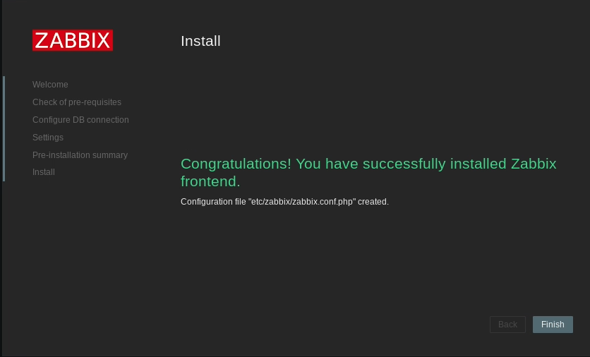

Ура победа, жмем Finish

Включаем zabbix-server

```bash
systemctl enable --now zabbix-server
```

Иногда может понадобиться указать пароль от бд в конфиге

```bash
vim /etc/zabbix/zabbix_server.conf
DBPassword=P@ssw0rd
systemctl restart zabbix-server
```

Дефолтные креды `Admin/zabbix`

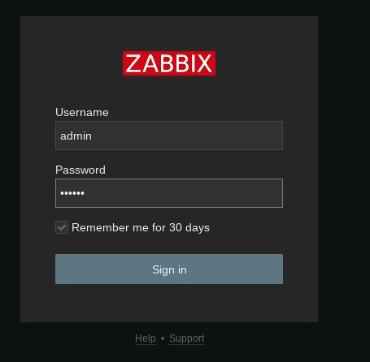

И не забываем поставить агента на сервер

```bash
apt install zabbix-agent
```

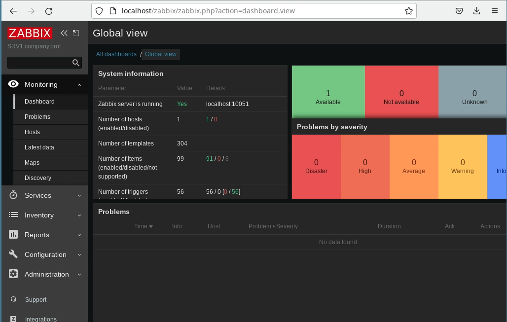

## Подключаем хосты

Ставим zabbix-agent, идем в конфигу, меняем `Server=127.0.0.1` на `Server=10.0.10.10`

После этого хост можно добавлять в zabbix

В zabbox идем в `Configuration -> Hosts`

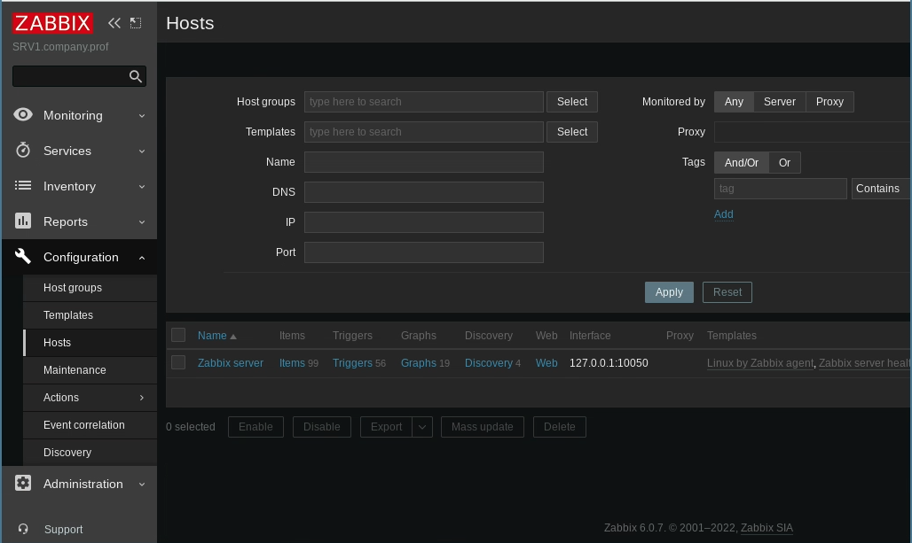

Справа сверху нажимаем `Create host`

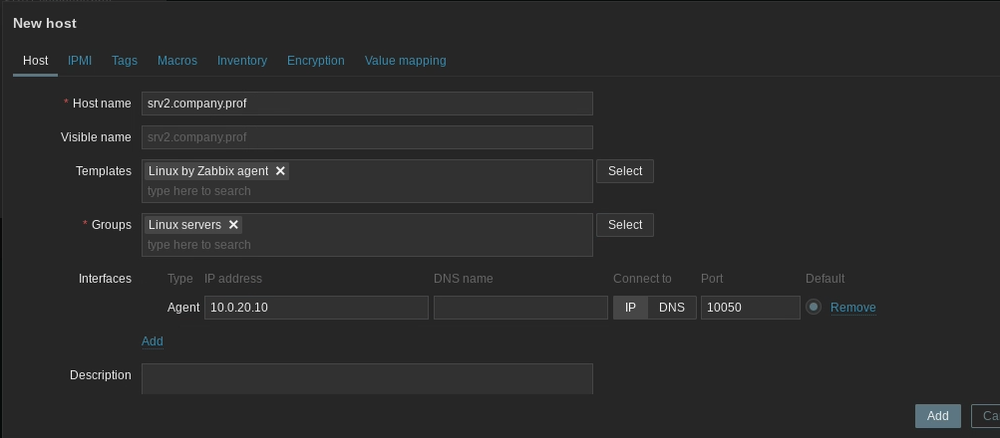

Заполняем как на картинке

После этого можно перейти в `Monitoring -> Dashboard -> All dashboards` и нажать `Create dashboard` в правом верхнем углу

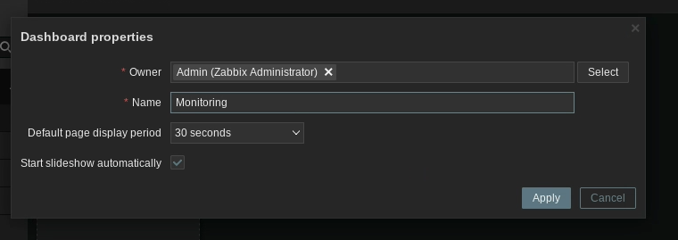

После этого добавляем виджеты, которые нам нужны

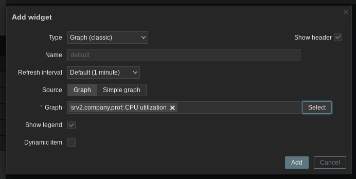

Готово

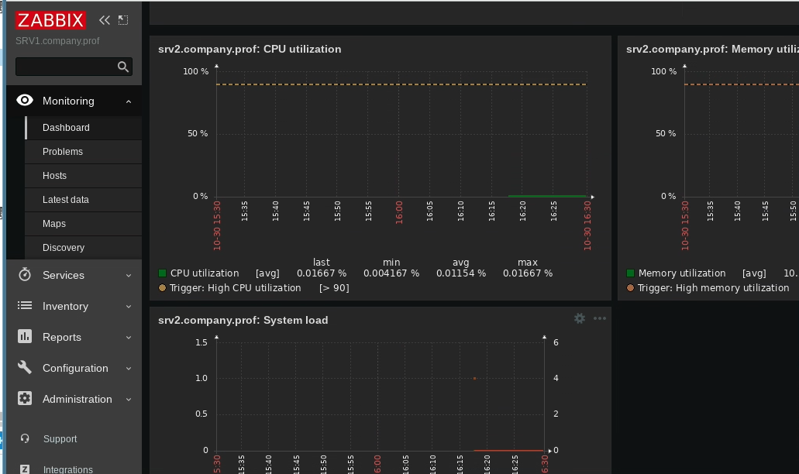
