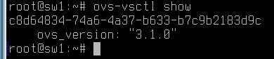
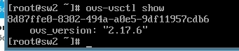
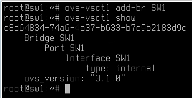
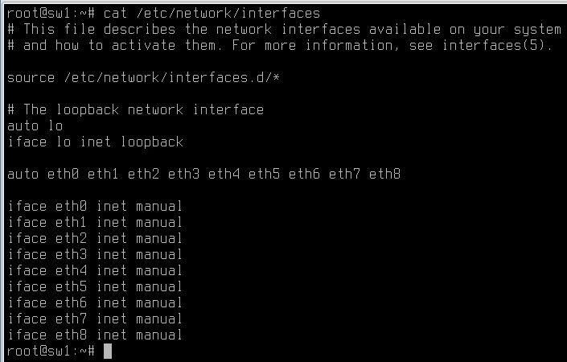
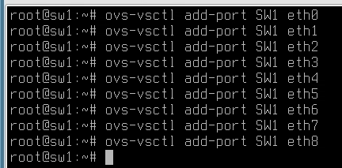
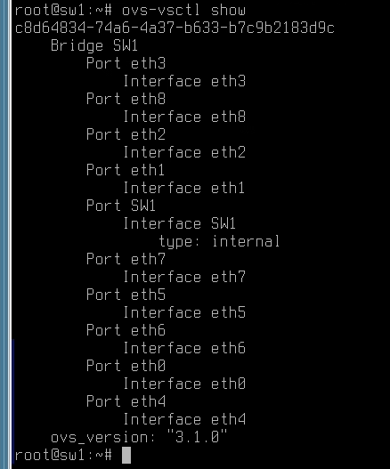
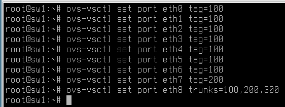
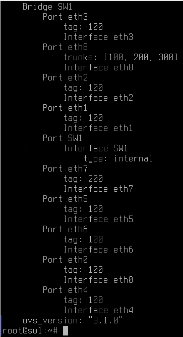
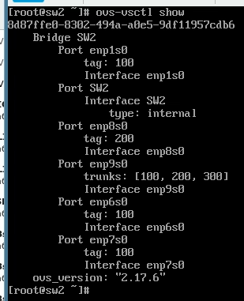

# Настройка коммутации

## Ставим openvswitch

На астре все просто

```bash
apt update
apt install openvswitch-switch
```

Проверяем, что все норм -- `ovs-vsctl show`



На альте пакет называется просто openvswitch

```bash
apt-get update
apt-get install openvswitch
```

А еще он не запускается по умолчанию

Запускаем его руками

```bash
systemctl enable --now openvswitch
```

Теперь можно проверить

```bash
ovs-vsctl show
```



## Настройка

Настройка будет одинаковая и на альте, и на астре

Во-первых, создаем бридж. Нам хватит одного

```bash
ovs-vsctl add-br SW1
```



Далее, нужно добавить наши интерфейсы в этот бридж. Добавляем все интернейсы

В `/etc/network/interfaces` хорошо бы добавить все интерфейсы в автозапуск, то есть в **manual**



В альте интерфейсы поднимаются после перегазгрузки сами, дополнительно ничего делать не нужно **Проверено**

Добавляем все интерфейсы в бридж

```bash
ovs-vsctl add-port <BRNAME> <PORTNAME>

ovs-vsctl add-port SW1 eth0
```



Выглядеть должно как-то так



Далее, интерфейсам необходимо раздать тэги

```bash
ovs-vsctl set port <PORTNAME> tag=<TAG>
ovs-vsctl set port <PORTNAME> trunks=<TAGS>

ovs-vsctl set port eth0 tag=100
ovs-vsctl set port eth8 trunks=100,200,300
```



Выглядеть должно как-то так



Аналогично на SW2



Остается создать менеджмент интерфейсы и с коммутацией все

Очевидно, чтоб все работало, нужна еще настройка со стороны ESR

Она будет прописана в отдельном файлике

Менеджмент создается просто

```bash
ovs-vsctl add-port SW2 vlan300 -- set interface vlan300 type=internal
```

После выполнения этой командочки появится интерфейс vlan300, на него можно навешать адрес

```bash
ip addr add 10.0.20.203/27 dev vlan300
ip route add default via 10.0.20.193
ip link set up vlan300
```
